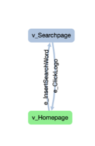
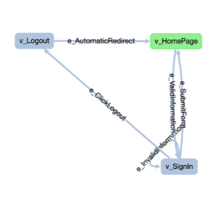
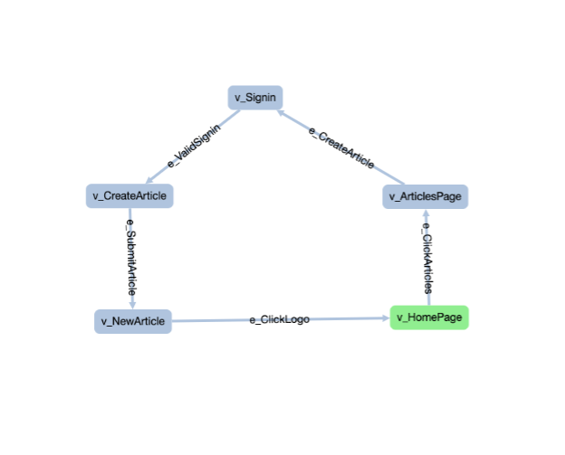
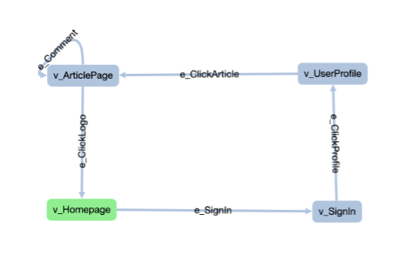

## Useful commands to run the project:

mvn clean install

mvn compile

mvn graphwalker:generate-sources

mvn compile exec:java -Dexec.mainClass="com.mbtroads.Runner"

### Search Test Flow:

### SignIn Test Flow:

### Article Test Flow:

### Comment Test Flow: 

